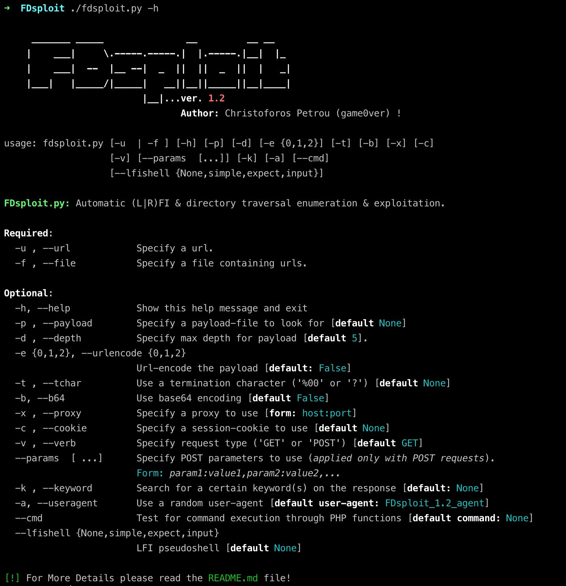
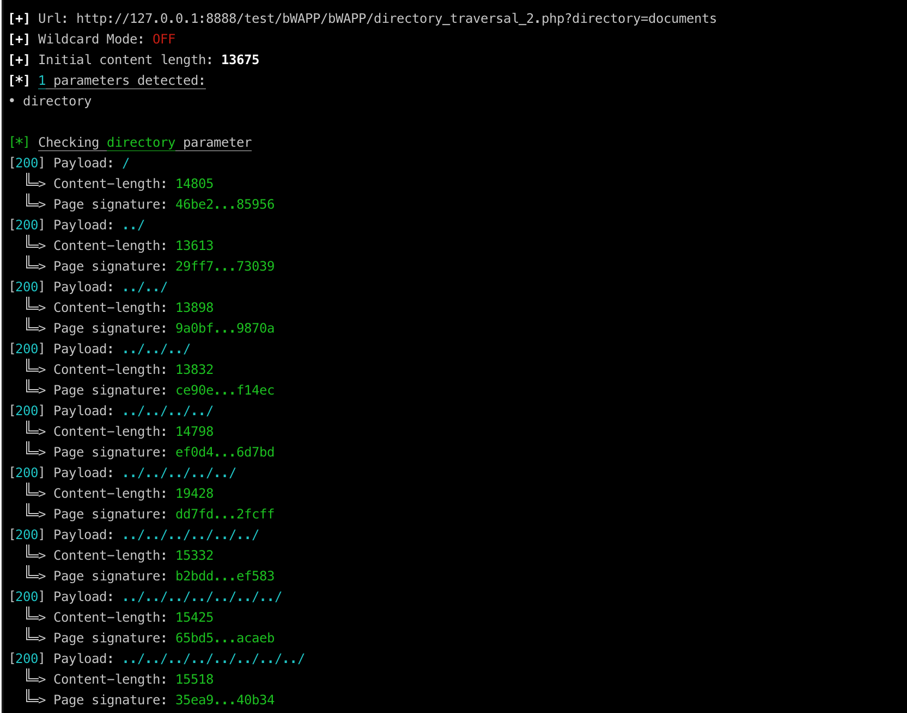
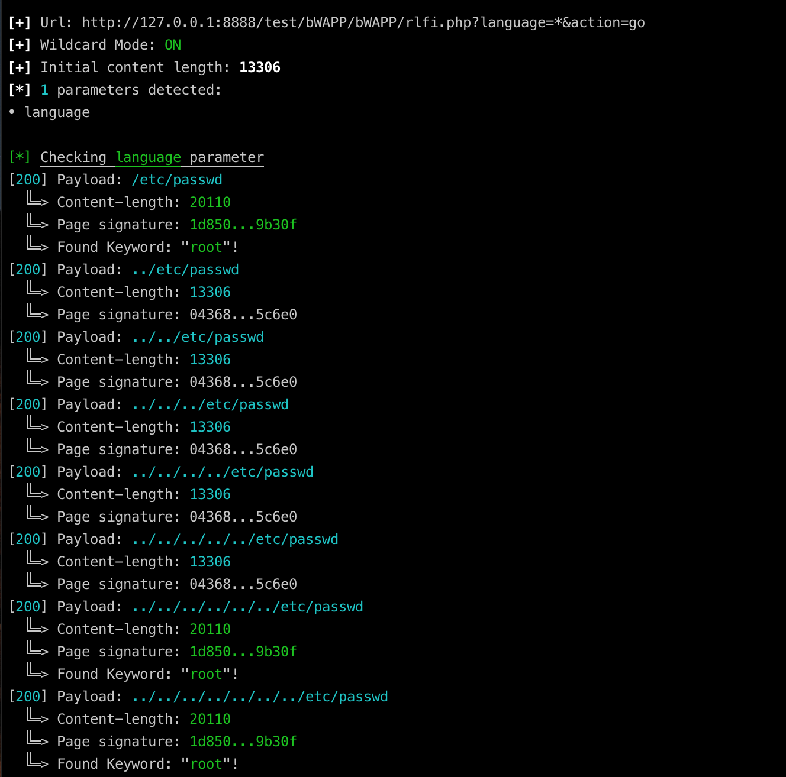
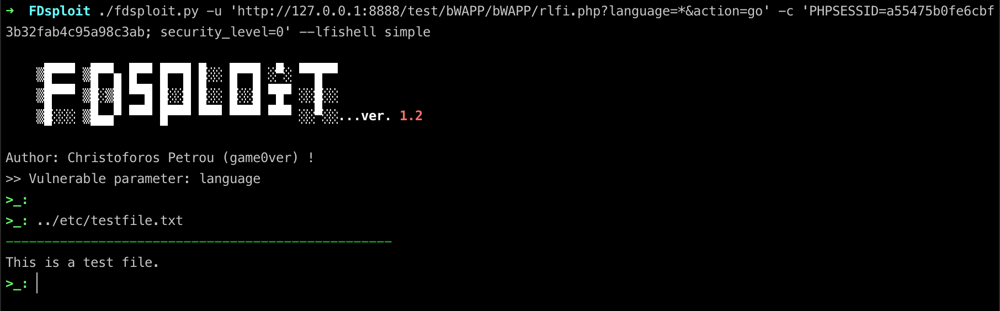

##### A File Inclusion & Directory Traversal fuzzing, enumeration & exploitation tool.
[](https://github.com/chrispetrou/FDsploit/blob/master/LICENSE) [](https://www.python.org/)  [](https://snyk.io//test/github/chrispetrou/FDsploit?targetFile=requirements.txt)
* * *

`FDsploit` menu:

```
$ python fdsploit.py -h

     _____ ____          _     _ _
    |   __|    \ ___ ___| |___|_| |_
    |   __|  |  |_ -| . | | . | |  _|
    |__|  |____/|___|  _|_|___|_|_|
                    |_|...ver. 1.2
                          Author: Christoforos Petrou (game0ver) !

usage: fdsploit.py [-u  | -f ] [-h] [-p] [-d] [-e {0,1,2}] [-t] [-b] [-x] [-c]
                   [-v] [--params  [...]] [-k] [-a] [--cmd]
                   [--lfishell {None,simple,expect,input}]

FDsploit.py: Automatic (L|R)FI & directory traversal enumeration & exploitation.

Required (one of the following):
  -u , --url            Specify a url or
  -f , --file           Specify a file containing urls

Optional:
  -h, --help            Show this help message and exit
  -p , --payload        Specify a payload-file to look for [default None]
  -d , --depth          Specify max depth for payload [default 5]
  -e {0,1,2}, --urlencode {0,1,2}
                        Url-encode the payload [default: False]
  -t , --tchar          Use a termination character ('%00' or '?') [default None]
  -b, --b64             Use base64 encoding [default False]
  -x , --proxy          Specify a proxy to use [form: host:port]
  -c , --cookie         Specify a session-cookie to use [default None]
  -v , --verb           Specify request type ('GET' or 'POST') [default GET]
  --params  [ ...]      Specify POST parameters to use (applied only with POST requests)
                        Form: param1:value1,param2:value2,...
  -k , --keyword        Search for a certain keyword(s) on the response [default: None]
  -a, --useragent       Use a random user-agent [default user-agent: FDsploit_1.2_agent]
  --cmd                 Test for command execution through PHP functions [default command: None]
  --lfishell {None,simple,expect,input}
                        LFI pseudoshell [default None]

[!] For More Details please read the README.md file!
```

<!--  -->

`FDsploit` can be used to discover and exploit Local/Remote File Inclusion and directory traversal vulnerabilities automatically. In case an LFI vulnerability is found, `--lfishell` option can be used to exploit it. For now, __3__ different types of LFI shells are supported:

*   `simple`: This type of shell allows user to read files easily without having to type the url everytime. __Also__ it only provides the output of the file and __not__ the whole html-source code of the page which makes it very useful.
*   `expect`: This type of shell is a semi-interactive shell which allows user to execute commands through PHP's `expect://` wrapper.
*   `input`: This type of shell is a semi-interactive shell which also allows user to execute commands through PHP's `php://input` stream.

So far, there are only two lfi-shell built-in commands:
*   `clear` and
*   `exit`.

### Features

*   The LFI-shell interface provides only the output of the file readed or the command issued and __not__ all the html code.
*   __3__ different types of LFI-shells can be specified.
*   Both GET/POST requests are supported.
*   Automatic detection of GET parameters.
*   Certain parameters can be specified for testing using wildcards (`*`).
*   Optional session cookies can be specified and used.
*   Automatic check for RCE using PHP functions can be performed.
*   Additional use of sha-256 hash is used to identify the potential vulnerabilities.
*   base64/urlencoding support.

### Some Examples

#### 1. Directory traversal vulnerability discovery:

From the below output it seems that the `directory` parameter is probably vulnerable to directory traversal vulnerability since every request with `../` as payload produces a different _sha-256_ hash. Also the content-length is different for every request:

```python
./fdsploit.py -u 'http://127.0.0.1:8888/test/bWAPP/bWAPP/directory_traversal_2.php?directory=documents' -c 'PHPSESSID=7acf1c5311fee614d0eb40d7f3473087; security_level=0' -d 8
```


#### 2. LFI vulnerability discovery:

Again, the language parameter seems vulnerable to **LFI** since using `../etc/passwd` _etc.._ as payload, every request being colored with green produces a different hash, a different content-length from the initial, and the keyword specified is found in the response:

```python
./fdsploit.py -u 'http://127.0.0.1:8888/test/bWAPP/bWAPP/rlfi.php?language=*&action=go' -c 'PHPSESSID=7acf1c5311fee614d0eb40d7f3473087; security_level=0' -d 7 -k root -p /etc/passwd
```


#### 3. LFI exploitation using simple shell:

Exploiting the above LFI using `simple` shell:



### Notes

1.  When `POST` verb is used, `--params` option must also be specified.
2.  To test for _Directory Traversal_ vulnerability the `--payload` option must be left to default value (_None_).
3.  When `--file` options is used for multiple-urls testing, then only GET request is supported.
4.  When __both__ `--file` & `--cookie` options are set then since only one cookie can be specified each time the urls must refer on the same domain or be accessible without a cookie (_that's is going to be fixed in a future update_).
5.  `input` shell is not compatible with `POST` verb.

### Requirements:

**Note:** To install the requirements:

`pip install -r requirements.txt --upgrade --user`

💡 `FDsploit` also comes pre-installed with [BlackArch Linux distribution](https://blackarch.org/).

### TODO
- [ ] Fix _note 4_ from above and make `--file` also work with POST parameters and cookies, using probably a `json` etc... file as input.
- [ ] Add more built-in commands to `--lfishell` e.g. _history etc..._

### Contributions & Feedback

Feedback and contributions are welcome. If you find any bug or have a feature request feel free to open an issue, and as soon as I review it I'll try to fix it!

### Disclaimer
>This tool is only for testing and academic purposes and can only be used where strict consent has been given. Do not use it for illegal purposes! It is the end user’s responsibility to obey all applicable local, state and federal laws. Developers assume no liability and are not responsible for any misuse or damage caused by this tool and software in general.

## Credits

*   The FDsploit logo is made with [fontmeme.com](https://fontmeme.com/graffiti-fonts/)!

## License

This project is licensed under the GPLv3 License - see the [LICENSE](LICENSE) file for details